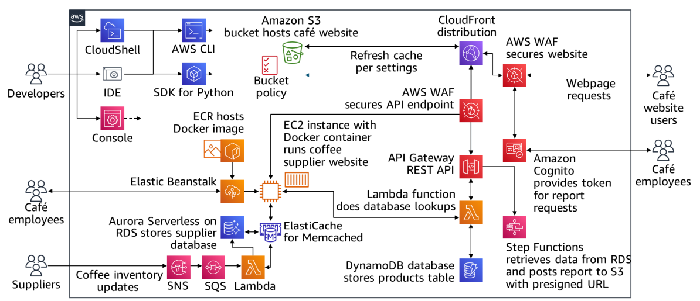

# ☁️ Serverless Café Website (AWS)  


A fully serverless café website leveraging AWS services for scalability, security, and cost-efficiency.  

## 📋 **Features**  
- **Secure Authentication**: Amazon Cognito with MFA and AWS WAF protection against SQLi/XSS.  
- **Event-Driven Backend**: RESTful API via Lambda & API Gateway, order processing with SNS/SQS.  
- **Scalable Database**: DynamoDB with millisecond response times and automated backups.  
- **CI/CD Pipeline**: Automated deployments using CodePipeline, CodeBuild, and IaC with CloudFormation.  
- **Monitoring**: CloudWatch for logs/metrics and X-Ray for API tracing.  

## 🛠️ **Architecture**  
  

## 🚀 **Technologies Used**  

| Service               | Use Case                              |  
|-----------------------|---------------------------------------|  
| **AWS Lambda**        | Serverless backend logic              |  
| **Amazon API Gateway**| HTTP request handling                 |  
| **DynamoDB**          | NoSQL database for orders/menu        |  
| **Amazon S3**         | Static asset storage & frontend hosting |  
| **Amazon Cognito**    | User authentication & MFA             |  
| **AWS CodePipeline**  | CI/CD automation                      |  

## 📂 **Setup Steps**  

### 1️⃣ Clone the Repository  
   ```bash  
   git clone https://github.com/yourusername/serverless-cafe-aws.git  
   ```  

### 2️⃣ Infrastructure Deployment  
Deploy the CloudFormation template to create the AWS stack:  
   ```bash  
   aws cloudformation create-stack --stack-name ServerlessCafe --template-body file://infra/template.yaml  
   ```  

### 3️⃣ Configure CI/CD Pipeline  
- Connect CodePipeline to your GitHub repository.  
- Define build specifications in `buildspec.yml`.  

### 4️⃣ Configure Authentication  
- Set up Cognito User Pool and Identity Pool via the AWS Console.  

### 5️⃣ Deploy Frontend  
- Upload static files to S3 and enable CloudFront for global distribution.  

## 🔍 **Monitoring & Logging**  
- **CloudWatch Alarms**: Track Lambda execution errors and API latency.  
- **X-Ray Traces**: Visualize API call flows to identify bottlenecks.  

## 💡 **Benefits**  
- **Cost Efficiency**: Pay-per-use pricing with Lambda and S3 lifecycle policies.  
- **High Availability**: Multi-AZ deployment and DynamoDB auto-scaling.  
- **Security**: Least-privilege IAM roles, WAF, and encrypted data storage.  

## 📜 **License**  
MIT License. See [LICENSE](LICENSE) for details.

